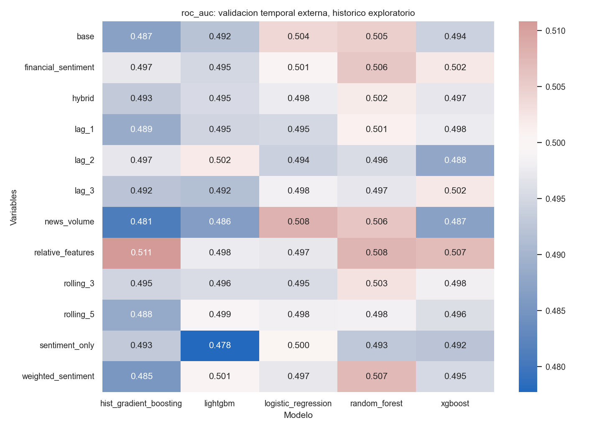

# Predicción bursátil con sentimiento financiero

[](https://github.com/maarcoopg/tfg-ml-financial-sentiment/actions/workflows/tests.yml)

**Python 3.13 · Aprendizaje automático · Validación temporal · FinBERT**

¿Aporta el sentimiento de las noticias información adicional a los precios para
predecir la dirección de la siguiente sesión? Este proyecto estudia esa pregunta
con **Apple, Microsoft, NVIDIA y Tesla**, comparaciones controladas y resultados
trazables. Desarrollado por **Marco Padilla Gómez** como Trabajo de Fin de Grado
en Ingeniería del Software de la Universidad de Sevilla.

[Instalación](#instalación) · [Resultados](#consultar-resultados) · [Entrenamiento](#ejecutar-experimentos) · [FinBERT](#finbert-opcional) · [Pruebas](#pruebas) · [Documentación](#documentación)

> **Alcance:** investigación retrospectiva y exploratoria, no un sistema de
> inversión. Los experimentos no demuestran una mejora predictiva general y
> robusta del sentimiento frente a usar solo información financiera.

## Qué se compara

La unidad de análisis es una pareja **empresa-sesión**. La etiqueta vale `1` si el
cierre ajustado de la siguiente sesión supera al actual, y `0` en caso contrario.
SPY se descargó como referencia, pero **no participa en el entrenamiento**.

| Enfoque | Información utilizada |
| --- | --- |
| Financiero base | Precios, volumen, retornos e indicadores técnicos |
| Híbrido | Variables financieras y sentimiento de noticias de Alpha Vantage |
| Híbrido con retardo | Información financiera y persistencia temporal del sentimiento |
| Híbrido con FinBERT | Sentimiento calculado localmente sobre noticias emparejadas con Alpha Vantage |

Se estudian regresión logística, bosque aleatorio, boosting por histogramas,
XGBoost y LightGBM, además de una referencia de clase mayoritaria. Algunas
ampliaciones utilizan solo tres algoritmos para acotar la experimentación.
El número de variables depende del protocolo: no se mezclan resultados de
ejecuciones distintas como si pertenecieran a una única comparación.

El diseño incluye calendario bursátil real, asignación de noticias al cierre,
validación temporal anidada, purga de etiquetas e intervalos pareados. También
se han probado modelos por empresa, representaciones relativas, deduplicación,
ventanas de entrenamiento y ablaciones de variables.

## Instalación

Se utiliza **Python 3.13**, también configurado en GitHub Actions. Ejecuta los
comandos desde la raíz del repositorio. Si ya tienes una copia y un entorno
configurado, no necesitas volver a clonarlos ni crearlos.

```bash
git clone https://github.com/maarcoopg/tfg-ml-financial-sentiment.git
cd tfg-ml-financial-sentiment
```

**Windows · PowerShell**

```powershell
python -m venv .venv
.\.venv\Scripts\Activate.ps1
python -m pip install -r requirements.txt
```

Si PowerShell no permite activar el entorno, utiliza directamente
`.\.venv\Scripts\python.exe` en lugar de `python` en los comandos siguientes.
No hace falta cambiar la política de ejecución del sistema.

<details>
<summary>Linux y macOS</summary>

Con Python 3.13 seleccionado como `python3`:

```bash
python3 -m venv .venv
source .venv/bin/activate
python -m pip install -r requirements.txt
```

</details>

Las dependencias de PLN son opcionales y se instalan aparte en
[FinBERT](#finbert-opcional). No se necesitan credenciales de Alpha Vantage para
consultar informes guardados ni ejecutar las pruebas automatizadas.

## Consultar resultados

**Para empezar sin entrenar:** abre el [notebook 02](notebooks/02_model_results.ipynb)
o los [resultados de la revisión temporal](docs/resultados_revision_temporal.md).
El notebook 02 utiliza los informes versionados, sin modelos `.joblib` ni API.

Para explorar los cuadernos localmente:

```powershell
python -m ipykernel install --user --name tfg-finanzas --display-name "Python (TFG Finanzas)"
python -m jupyter lab notebooks/
```

Selecciona el kernel **Python (TFG Finanzas)**. La [guía de notebooks](docs/notebooks.md)
detalla los datos y dependencias de cada cuaderno; no todos tienen los mismos
requisitos para volver a ejecutarse.

| Cuaderno | Pregunta que estudia |
| --- | --- |
| [01 · Datos y calidad](notebooks/01_dataset_exploration.ipynb) | ¿Qué datos se utilizan y qué cobertura tienen? |
| [02 · Modelos y resultados](notebooks/02_model_results.ipynb) | ¿Mejora el híbrido a la referencia financiera? |
| [03 · Modelos por empresa](notebooks/03_per_company_models.ipynb) | ¿Ayuda entrenar cada activo por separado? |
| [04 · Identidad y variables relativas](notebooks/04_ticker_aware_models.ipynb) | ¿Cómo representar las diferencias entre empresas? |
| [05 · Ronda controlada de mejoras](notebooks/05_controlled_improvement_round.ipynb) | ¿Qué cambia al depurar, enriquecer y ajustar? |
| [06 · Ablación de sentimiento](notebooks/06_sentiment_variable_ablation.ipynb) | ¿Qué aporta cada variable al añadirla o retirarla? |
| [07 · Funcionamiento de FinBERT](notebooks/07_finbert_model_understanding.ipynb) | ¿Cómo transforma el texto en probabilidades? |
| [08 · Evaluación del sentimiento](notebooks/08_finbert_sentiment_evaluation.ipynb) | ¿Cómo responde al contexto y a cambios lingüísticos? |
| [09 · FinBERT en la predicción bursátil](notebooks/09_finbert_predictive_evaluation.ipynb) | ¿Qué ocurre al cambiar de fuente de sentimiento? |

<details>
<summary>Vista de resultados de la revisión temporal</summary>



Figura procedente de `review-full-20260908`, con
[procedencia verificable](reports/final/provenance.json). No incluye los
experimentos posteriores con FinBERT ni sustituye a los intervalos de incertidumbre.

</details>

### Cómo interpretar la evidencia

- El histórico se ha consultado durante el desarrollo: los resultados son exploratorios.
- AUC agrupado, AUC macro por empresa y exactitud son medidas diferentes.
- La comparación lingüística con referencia de IA **no es validación humana independiente**.
- No se han simulado comisiones, ejecución de órdenes ni rentabilidad de una estrategia.

Los informes completos conservan también resultados negativos:
[modelos por empresa](reports/experiments/per-company-20260916/analysis.md),
[representación](reports/experiments/ticker-aware-full-20260916/analysis.md),
[ronda de mejoras](reports/experiments/first-round-full-20260916/analysis.md),
[ablaciones](reports/experiments/variable-ablation-full-20260917/analysis.md) y
[FinBERT emparejado](reports/experiments/finbert-predictive-full-20260928/analysis.md).

## Ejecutar experimentos

### Preparar las entradas

El ejecutor principal **no descarga datos**. Antes de entrenar deben existir:

| Ruta | Contenido requerido |
| --- | --- |
| `data/raw/prices/<TICKER>.csv` | Precios originales de AAPL, MSFT, NVDA y TSLA |
| `data/processed/prices/<TICKER>_with_target.csv` | Etiqueta e indicadores financieros calculados |
| `data/processed/news/financial_news_with_sentiment.csv` | Noticias clasificadas con sentimiento y relevancia |

La [guía de ejecución](docs/full_pipeline_execution.md) explica la preparación en
orden. Para descargar noticias necesitas tu propia clave en un archivo `.env`
local, excluido de Git:

```dotenv
ALPHA_VANTAGE_API_KEY=tu_clave
```

**No vuelvas a descargar datos solo para consultar resultados.** Las descargas
pueden consumir cuota y sustituir entradas locales. Reproducir exactamente una
ejecución requiere las entradas y versiones identificadas por su manifiesto;
descargar un histórico actualizado no garantiza obtener los mismos resultados.

### Comprobación reducida

Con las entradas preparadas y el entorno activado:

```powershell
python -m src.experiments.run_review --run-dir artifacts/verification/mi-comprobacion --models logistic_regression --variants base hybrid lag_1 --outer-splits 2 --inner-splits 2 --bootstrap-repeats 100
```

Este comando entrena una comparación reducida; no es una prueba unitaria ni
reproduce todas las métricas de la ejecución completa.

### Revisión completa

```powershell
python -m src.experiments.run_review --run-dir reports/experiments/mi-revision
```

Se generan predicciones, métricas, intervalos, figuras y un manifiesto. Modelos,
datos e instantáneas de código se guardan por separado con el mismo identificador.
**Utiliza un identificador nuevo en cada ejecución:** el sistema rechaza colisiones
para no sobrescribir resultados anteriores. La ejecución completa puede ser costosa.

Para consultar opciones sin entrenar:

```powershell
python -m src.experiments.run_review --help
```

Los comandos de las ampliaciones por empresa, identidad, ventanas y ablaciones
están en la [guía de notebooks](docs/notebooks.md), junto con sus referencias y
requisitos de reproducibilidad.

## FinBERT opcional

La ampliación utiliza **`ProsusAI/finbert` con pesos congelados** y una revisión
fijada. Estudia tokenización, representaciones, atención, bloques del codificador,
logits, probabilidades, atribuciones y sensibilidad al contexto. No entrena un
modelo de lenguaje nuevo ni envía las noticias a una API de inferencia.

Para instalar la variante CPU sobre el entorno base:

```powershell
python -m pip install torch==2.8.0 --index-url https://download.pytorch.org/whl/cpu
python -m pip install -r requirements-finbert.txt
```

La [guía del modelo](docs/finbert_modelo.md) explica cómo descargar inicialmente
los pesos e inspeccionarlos. La primera descarga requiere conexión; después se
utiliza la caché local de `models/pretrained/`. Se necesitan también las noticias
procesadas para repetir el estudio con entradas reales.

Con las entradas y el modelo local disponibles, la comparación bursátil se ejecuta con:

```powershell
python -m src.experiments.run_finbert --run-dir reports/experiments/mi-finbert --device cpu
```

Consulta antes el [protocolo de comparación](docs/finbert_prediccion_protocolo.md):
separar el efecto del filtrado de noticias del cambio de sentimiento es parte del
experimento. No reutilices una carpeta anterior. La GPU es opcional y requiere
un entorno compatible, descrito en el protocolo.

## Pruebas

```powershell
python -m unittest discover -s tests -v
```

Las pruebas cubren disponibilidad temporal, purga, aislamiento por empresa,
deduplicación, variantes, artefactos e integración de FinBERT. Las pruebas
opcionales de BERT se omiten si faltan sus dependencias; con ellas instaladas
utilizan modelos pequeños locales, sin descargar el checkpoint completo.
El [workflow de GitHub Actions](.github/workflows/tests.yml) separa el pipeline
financiero de las pruebas opcionales de PLN.

## Estructura

```text
src/          Adquisición, preparación, modelos, experimentos, PLN y gráficos
tests/        Pruebas automatizadas
notebooks/    Nueve cuadernos de exploración y evaluación
docs/         Guías técnicas y protocolos experimentales
reports/      Informes, métricas, predicciones, figuras y manifiestos
data/         Entradas y conjuntos de datos locales
models/       Modelos entrenados y pesos de FinBERT
artifacts/    Instantáneas de código y verificaciones locales
.github/      Integración continua y plantillas de issues
```

Los `.joblib`, pesos preentrenados, datos de ejecución y artefactos locales están
excluidos de Git. **Clonar el repositorio no recupera esos archivos.**
`reports/experiments/` conserva cada investigación; `reports/historical/`, los
ensayos previos; y `reports/final/`, una selección de `review-full-20260908`, no
automáticamente el experimento más reciente. Véase la
[organización de resultados](docs/report_organization.md).

## Documentación

| Guía | Uso |
| --- | --- |
| [Ejecución completa](docs/full_pipeline_execution.md) | Preparar entradas y recorrer el flujo de trabajo |
| [Resultados temporales](docs/resultados_revision_temporal.md) | Entender el protocolo principal, las métricas y sus límites |
| [Organización de resultados](docs/report_organization.md) | Localizar artefactos y verificar su procedencia |
| [Notebooks](docs/notebooks.md) | Elegir un cuaderno y conocer sus requisitos |
| [Ronda de mejoras](docs/first_round_protocol.md) | Revisar los cambios controlados y el ajuste |
| [Ablación de variables](docs/variable_ablation_protocol.md) | Interpretar adiciones y retiradas de variables |
| [Modelo FinBERT](docs/finbert_modelo.md) | Comprender e inspeccionar su funcionamiento interno |
| [Evaluación lingüística](docs/finbert_evaluacion_protocolo.md) | Revisar corpus, contexto, atribuciones y límites de la referencia de IA |
| [FinBERT y predicción](docs/finbert_prediccion_protocolo.md) | Reproducir la comparación financiera emparejada |
