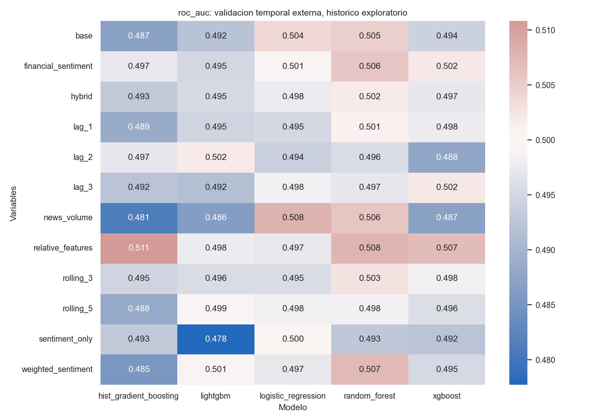

# Modelo híbrido de aprendizaje automático para la predicción de tendencias bursátiles mediante análisis técnico y sentimiento financiero

**Borrador de la memoria del Trabajo de Fin de Grado**  
Grado en Ingeniería del Software · Universidad de Sevilla  
**Autor:** Marco Padilla Gómez  
**Tutor:** Jose Antonio Troyano Jimenez  

> Este documento describe la implementación y los experimentos existentes. No presenta como realizadas las propuestas futuras. La revisión principal corresponde a `review-full-20260908` y se amplía con `per-company-20260916` y `ticker-aware-full-20260916`. Se distinguen sus métricas y todos los resultados se consideran exploratorios, al reutilizar un histórico ya examinado.

## Índice

1. [Resumen](#1-resumen)
2. [Introducción y motivación](#2-introducción-y-motivación)
3. [Objetivos, hipótesis y alcance](#3-objetivos-hipótesis-y-alcance)
4. [Fundamentos y referencias](#4-fundamentos-y-referencias)
5. [Requisitos y diseño del software](#5-requisitos-y-diseño-del-software)
6. [Datos y construcción del objetivo](#6-datos-y-construcción-del-objetivo)
7. [Variables financieras y sentimiento](#7-variables-financieras-y-sentimiento)
8. [Disponibilidad temporal y calidad de datos](#8-disponibilidad-temporal-y-calidad-de-datos)
9. [Modelos y selección de hiperparámetros](#9-modelos-y-selección-de-hiperparámetros)
10. [Diseño experimental y evaluación](#10-diseño-experimental-y-evaluación)
11. [Resultados](#11-resultados)
12. [Discusión](#12-discusión)
13. [Verificación y reproducibilidad](#13-verificación-y-reproducibilidad)
14. [Proceso de desarrollo y decisiones](#14-proceso-de-desarrollo-y-decisiones)
15. [Limitaciones y trabajo futuro](#15-limitaciones-y-trabajo-futuro)
16. [Conclusiones](#16-conclusiones)
17. [Bibliografía inicial](#17-bibliografía-inicial)
18. [Anexos y revisión pendiente](#18-anexos-y-revisión-pendiente)

## 1. Resumen

Este trabajo estudia si incorporar sentimiento de noticias financieras aporta información predictiva adicional a un modelo basado en precios, volumen e indicadores técnicos. La tarea consiste en clasificar la dirección del precio ajustado de cierre de la siguiente sesión, no en estimar un precio exacto ni en desarrollar un sistema de negociación real.

Se construye un flujo de procesamiento modular en Python para integrar datos de Yahoo Finance, obtenidos mediante `yfinance`, y noticias con sentimiento por empresa de Alpha Vantage. El universo de modelado comprende Apple, Microsoft, NVIDIA y Tesla durante el histórico de 2015 a 2025. SPY se descargó inicialmente como referencia, pero no participa en los entrenamientos.

El desarrollo evolucionó desde una partición temporal simple hacia una evaluación anidada con entrenamiento expansivo, purga del horizonte de las etiquetas y asignación de noticias según el cierre real del mercado. Se compararon cinco algoritmos predictivos y una referencia de clase mayoritaria. El experimento corregido comprende doce variantes de variables, tres bloques externos y tres particiones internas: 1.080 ajustes internos y 183 entrenamientos externos.

El mayor ROC-AUC agrupado observado fue 0,5108, con HistGradientBoosting y variables relativas, con un intervalo exploratorio del 95 % de [0,4855; 0,5406]. La comparación principal entre LightGBM híbrido con y sin retardo de una sesión presentó una diferencia de AUC de aproximadamente −0,0008, cuyo intervalo incluyó cero. Por tanto, no se demuestra una ventaja predictiva robusta del sentimiento con los datos, representaciones y protocolo utilizados.

La contribución del proyecto es tanto experimental como de ingeniería: integración de fuentes heterogéneas, control temporal explícito, evaluación comparable y conservación verificable de resultados. El histórico ya había sido consultado, por lo que los resultados deben considerarse exploratorios y no una confirmación independiente.

Dos experimentos adicionales estudian si conviene especializar el aprendizaje por empresa o conservar el entrenamiento conjunto incorporando identidad, variables relativas e interacciones. Entrenar por separado no mejora el promedio general. Las variables relativas producen pequeñas mejoras descriptivas, pero ninguno de los 81 intervalos de diferencias de AUC macro del segundo experimento excluye cero. Destaca el bosque aleatorio híbrido en NVDA: pasa de 0,5180 a 0,5717 de AUC al utilizar relativas e identificador, aunque sin identificador ya obtiene 0,5711. Esta señal no se generaliza a todas las empresas ni demuestra rentabilidad.

**Palabras clave:** aprendizaje automático, sentimiento financiero, series temporales, clasificación binaria, validación temporal, reproducibilidad.

## 2. Introducción y motivación

Los precios y las noticias representan fuentes de información diferentes. Los primeros resumen movimientos ya observados; las segundas contienen mensajes sobre empresas, expectativas y acontecimientos. La motivación del proyecto consiste en estudiar si una representación numérica de esas noticias ayuda a clasificar movimientos posteriores cuando se añade a un conjunto financiero común.

La existencia de noticias relacionadas con un movimiento no implica que su sentimiento permita anticiparlo. Una noticia puede describir un cambio de precio que ya ocurrió, publicarse cuando parte de la información ya se ha incorporado al mercado o resultar relevante a un horizonte distinto del estudiado. Por ello, la disponibilidad temporal y la comparación con referencias sencillas forman parte del problema, no son detalles secundarios.

Desde Ingeniería del Software, el trabajo requiere resolver adquisición de datos, validación, transformación, contratos entre módulos, almacenamiento de experimentos y comunicación de resultados. Una mejora aparente obtenida con una evaluación incorrecta no cumpliría el objetivo académico, aunque mostrase una métrica atractiva.

## 3. Objetivos, hipótesis y alcance

### 3.1 Pregunta de investigación

¿Mejora la incorporación de sentimiento financiero la capacidad de discriminar subidas y no subidas de la siguiente sesión respecto a utilizar exclusivamente información financiera histórica?

### 3.2 Objetivos específicos

1. Construir conjuntos de datos financieros y de noticias trazables por empresa y fecha.
2. Definir una etiqueta y variables coherentes con el instante de predicción.
3. Comparar configuraciones base e híbrida sobre las mismas observaciones.
4. Seleccionar hiperparámetros sin utilizar el bloque externo correspondiente.
5. Investigar si retardos, ventanas, relevancia, representaciones relativas y especialización por empresa modifican los resultados.
6. Cuantificar incertidumbre y documentar los límites de las conclusiones.
7. Proporcionar programas, pruebas y cuadernos de análisis que permitan inspeccionar y reproducir el experimento.

La hipótesis principal plantea una posible contribución adicional del sentimiento. Una hipótesis secundaria plantea persistencia durante varias sesiones. También se estudia si entrenar un modelo independiente por empresa mejora la adaptación a sus características, y si un modelo conjunto con identidad e interacciones puede conservar información compartida sin ignorar esas diferencias. Las comparaciones realizadas no establecen una ventaja general confirmada; el resultado favorable en NVDA con variables relativas requiere validación independiente.

### 3.3 Alcance y exclusiones

La unidad de observación es una pareja empresa-sesión. La revisión inicial utiliza modelos conjuntos para las cuatro empresas sin introducir el identificador bursátil como predictor. Los experimentos adicionales comparan modelos independientes y modelos conjuntos con indicadores binarios de empresa, variables relativas e interacciones. La clasificación es diaria y binaria. No se desarrolla predicción intradía, una política de inversión, ejecución de órdenes ni una simulación económica retrospectiva. Tampoco se entrena un modelo propio de lenguaje: el sentimiento empleado procede del proveedor.

## 4. Fundamentos y referencias

### 4.1 Análisis técnico como representación

El análisis técnico se utiliza aquí para transformar el historial en variables tabulares: retornos, tendencia suavizada, oscilación y variabilidad. No se presupone que un indicador implique rentabilidad. La comparación experimental determina si estas representaciones resultan útiles en la tarea definida.

### 4.2 Sentimiento financiero e integración temprana

Una noticia puede recibir una puntuación de tono distinta para cada empresa mencionada. Por ello se utiliza la puntuación por empresa en lugar de asumir que el tono global del artículo es adecuado para todas sus empresas. El servicio de consulta de Alpha Vantage proporciona noticias y metadatos de sentimiento; su documentación describe los filtros temporales y por activos. [Alpha Vantage](https://www.alphavantage.co/documentation/#news-sentiment).

En este trabajo, «híbrido» significa concatenar variables financieras y variables de sentimiento antes del clasificador. No significa combinar dos redes neuronales ni construir un sistema multimodal entrenado de extremo a extremo. Se valoraron alternativas como diccionarios o FinBERT, pero no se implementaron como fuente operativa de los resultados presentados.

### 4.3 Aprendizaje supervisado tabular

La regresión logística constituye una referencia lineal; el bosque aleatorio (Random Forest) combina árboles; HistGradientBoosting, XGBoost y LightGBM representan enfoques de potenciación por gradiente, que combina modelos débiles de forma secuencial. XGBoost y LightGBM se incorporaron para ampliar la comparación de modelos tabulares, no porque su superioridad estuviera garantizada. Véanse los artículos originales de [XGBoost](https://arxiv.org/abs/1603.02754) y [LightGBM](https://papers.nips.cc/paper_files/paper/2017/hash/6449f44a102fde848669bdd9eb6b76fa-Abstract.html).

### 4.4 Evaluación temporal

La validación temporal mantiene el entrenamiento antes de la evaluación. La documentación de [TimeSeriesSplit](https://scikit-learn.org/stable/modules/generated/sklearn.model_selection.TimeSeriesSplit.html) ofrece una referencia sobre particiones ordenadas. La implementación del proyecto es propia: divide fechas completas y añade purga según `target_end`, manteniendo juntas las empresas de una sesión. No debe confundirse con aplicar directamente validación cruzada aleatoria con k particiones ni con una llamada literal a TimeSeriesSplit.

Esta sección constituye una fundamentación inicial, no una revisión sistemática de literatura. Antes de la entrega deben ampliarse los antecedentes de predicción financiera y sentimiento con estudios comparables, registrando universo, horizonte, fuentes, protocolo y limitaciones de cada estudio.

## 5. Requisitos y diseño del software

### 5.1 Requisitos verificables

| Requisito | Solución implementada | Evidencia |
| --- | --- | --- |
| Relacionar precios y noticias por empresa | Claves `ticker`, `Date` y asignación bursátil | `src/data/point_in_time.py` |
| Evitar datos posteriores al instante de decisión | Primer cierre igual o posterior a la marca temporal | Pruebas de calendario y asignación |
| Evitar etiquetas solapadas en validación | Purga con `target_end < inicio_validación` | `src/models/temporal_validation.py` |
| Comparar sobre el mismo universo | Predicciones pareadas por empresa y fecha | Validación de claves y objetivo |
| Aislar imputación y escalado | Cadena de preprocesamiento y modelado ajustada en cada entrenamiento | `src/models/train_models.py` |
| No sobrescribir experimentos anteriores | Identificador nuevo y rechazo de colisiones | `src/experiments/artifacts.py` |
| Conservar resultados auditables | CSV, manifiestos y hashes SHA-256 | `reports/experiments/` |
| Facilitar la explicación | Memoria, guías y cuatro cuadernos de análisis | `docs/` y `notebooks/` |

### 5.2 Arquitectura

```text
Precios descargados + noticias con sentimiento por empresa
                         |
          Validación, indicadores y etiqueta
                         |
     Alineación con el cierre y agregación diaria
                         |
           Variantes de variables comparables
                         |
   Selección interna -> entrenamiento -> bloque externo
                         |
       Predicciones, métricas e incertidumbre
                         |
              Informes y cuadernos
```

`src/data/` contiene adquisición y preparación; `src/models/`, construcción de estimadores, validación y evaluación; `src/experiments/`, orquestación de la revisión y gestión de artefactos; `src/visualization/`, figuras. Los cuadernos de análisis leen resultados o reconstruyen datos mediante funciones existentes; no duplican el entrenamiento completo.

Las dependencias se fijan en `requirements.txt`. El entorno de trabajo utilizado en las verificaciones es Python 3.13. Pandas y NumPy soportan transformaciones tabulares; scikit-learn, XGBoost y LightGBM, modelado; Matplotlib y Seaborn, gráficos; las librerías de calendario proporcionan sesiones y cierres.

### 5.3 Persistencia

Los informes se separan en `reports/historical/`, `reports/experiments/<id>/` y `reports/final/`. Esta última carpeta contiene una selección para la memoria, no una nueva evaluación. Los modelos se guardan en `models/experiments/<id>/`; los conjuntos de datos de ejecución, en `data/experiments/<id>/`; y las instantáneas de código, en `artifacts/snapshots/<id>/`. Las verificaciones técnicas se distinguen en `artifacts/verification/`.

Los `.joblib` y los artefactos locales pesados están excluidos del seguimiento ordinario de Git. Se conservan físicamente en el equipo. Esta decisión reduce ruido y tamaño en el repositorio, pero exige preservar los datos originales y el entorno para una reproducción externa; un manifiesto no sustituye a los archivos que identifica.

## 6. Datos y construcción del objetivo

### 6.1 Universo y periodo

Se descargaron inicialmente AAPL, MSFT, NVDA, TSLA y SPY. El modelado utiliza las cuatro empresas, con SPY excluido por ser un ETF y no disponer en este diseño de una señal corporativa comparable. No se evalúa, por tanto, una hipótesis de sentimiento sobre el índice.

El periodo solicitado fue 2015–2025. Los precios disponibles comienzan el 2 de enero de 2015 y llegan al 30 de diciembre de 2025. Al requerir la sesión siguiente para la etiqueta, la última fecha modelada es el 29 de diciembre de 2025. El panel de las cuatro empresas contiene 11.056 observaciones etiquetadas; no son 11.056 fechas independientes, sino filas empresa-sesión.

`yfinance` permite descargar campos de mercado como precios y volumen. La configuración y los CSV guardados son la evidencia efectiva de este proyecto; una descarga posterior puede no reproducir exactamente los mismos valores. [Documentación de yfinance](https://ranaroussi.github.io/yfinance/reference/api/yfinance.download.html).

### 6.2 Etiqueta

Para el cierre ajustado $P^{adj}_{i,t}$:

$$
y_{i,t}=\mathbb{1}\left(P^{adj}_{i,t+1}>P^{adj}_{i,t}\right).
$$

La clase cero incluye bajadas e igualdad; no equivale exclusivamente a «baja». El horizonte es la siguiente sesión disponible, no necesariamente el siguiente día natural. La última observación sin precio posterior se elimina. `next_adj_close` sirve para construir la etiqueta, pero no entra en las variables predictoras; tampoco entran `target`, `target_end` o `Date`. La columna textual `ticker` identifica y agrupa filas: solo el experimento de identidad incorpora indicadores binarios derivados de ella, nunca del objetivo.

Se utiliza `Adj Close` para objetivo, retorno e indicadores basados en cierre. La revisión comprueba el objetivo frente al precio bruto guardado y obtiene `target_end` a partir de la fecha de la siguiente observación. Esto permite expresar de forma explícita cuándo se conoce cada etiqueta.

### 6.3 Noticias y disponibilidad

La descarga usa Alpha Vantage, filtros por empresa y rangos temporales. El código parte de rangos anuales, divide rangos con al menos 950 resultados y establece un límite de 1.000. Si una sola jornada permanece saturada se produce un error explícito. Los fragmentos se guardan para reanudar descargas; se incorporan reintentos y validación de respuestas.

El acceso de pago se utilizó para ampliar la capacidad operativa de adquisición durante el proyecto. No se dispone aquí de una contabilidad validada de cuotas, facturas, horas o coste total, por lo que no se inventan importes. Una suscripción tampoco demuestra que el histórico del proveedor sea exhaustivo.

Los registros conservan empresa, título, resumen, URL, fuente, marca temporal, puntuación y relevancia. Una misma noticia puede aparecer asociada a varias empresas; los recuentos deben interpretarse como registros noticia-empresa, no necesariamente como artículos únicos en todo el corpus.

## 7. Variables financieras y sentimiento

### 7.1 Bloque financiero

El modelo base contiene 14 variables: `Adj Close`, `Close`, `High`, `Low`, `Open`, `Volume`, `daily_return`, `sma_5`, `sma_20`, `sma_50`, `RSI`, `MACD`, `MACD_signal` y `volatility_20`.

| Transformación | Definición operativa | Tratamiento inicial |
| --- | --- | --- |
| Retorno diario | Variación relativa de `Adj Close` | Primer retorno sin histórico: cero |
| SMA 5, 20 y 50 | Media móvil de `Adj Close` | `min_periods=1` |
| RSI 14 | Suavizado exponencial de ganancias y pérdidas, alfa 1/14 | Relleno inicial con 50 y rango [0,100] |
| MACD | EMA de 12 menos EMA de 26 sesiones | `adjust=False` |
| Señal MACD | EMA de 9 sesiones del MACD | Historial disponible |
| Volatilidad 20 | Desviación típica móvil del retorno diario | Mínimo dos observaciones; inicial cero |

Estas convenciones conservan las primeras filas y son decisiones de implementación. No equivalen a disponer de una ventana completa desde la primera sesión. Mezclar precios ajustados con niveles OHLC no ajustados también merece cautela al interpretar variables o comparar periodos con operaciones corporativas.

### 7.2 Bloque de sentimiento

La puntuación procede de `ticker_sentiment_score`; no es una predicción textual generada por un modelo entrenado en este TFG. Las etiquetas alcistas (`Bullish` y `Somewhat-Bullish`) se agrupan como positivas; las bajistas (`Bearish` y `Somewhat-Bearish`), como negativas; y la etiqueta `Neutral`, como neutral. El clasificador de etiquetas actual asigna también las etiquetas desconocidas a neutral: esta tolerancia constituye una limitación que debería sustituirse por auditoría explícita en una evolución del sistema.

Por empresa y sesión se calculan media, mediana, mínimo y máximo de tono; número de noticias; número de noticias en día no bursátil; conteos y proporciones positivos, negativos y neutrales; y `has_news`. Son 13 variables de sentimiento y, junto a las 14 financieras, 27 variables híbridas.

Las sesiones sin noticias registradas se conservan con puntuaciones, conteos y proporciones cero y `has_news=False`. No se interpreta «sin noticias registradas» como «no ocurrió nada» ni se confunde con una noticia de tono neutral. El indicador de presencia permite distinguir parcialmente ambos casos, pero no resuelve una cobertura incompleta.

### 7.3 Retardos y variantes controladas

El primer ensayo de persistencia añadió retardos de 1, 2 y 3 sesiones y medias móviles de 3 y 5 a las 13 variables de sentimiento: 65 variables nuevas, hasta 92 predictoras. Las operaciones se agrupan por empresa. Los retardos usan sesiones anteriores; las medias móviles incluyen la actual porque el instante de decisión se sitúa después de conocer su información.

La revisión posterior separó hipótesis para evitar modificar 65 variables a la vez:

| Variante | Variables | Propósito |
| --- | ---: | --- |
| `base` | 14 | Referencia financiera |
| `news_volume` | 16 | Añadir cantidad y presencia de noticias |
| `sentiment_only` | 8 | Tono, proporciones y presencia, sin precios ni conteos |
| `financial_sentiment` | 22 | Variables financieras más el bloque anterior |
| `hybrid` | 27 | Combinación completa de referencia |
| `lag_1`, `lag_2`, `lag_3` | 29 cada una | Híbrido más retardo de tono medio y cantidad |
| `rolling_3`, `rolling_5` | 29 cada una | Híbrido más media móvil de tono y cantidad |
| `weighted_sentiment` | 27 | Sustituir la media simple por media ponderada por relevancia |
| `relative_features` | 22 | Sustituir niveles por representaciones relativas y mantener sentimiento |

`sentiment_only` no es tono puro, porque incorpora proporciones y presencia. Las ventanas de `news_count` son medias, no sumas. La media ponderada es $\sum_j r_j s_j/\sum_j r_j$, con cero cuando no existe denominador válido.

Las variables relativas incluyen distancia a SMA, MACD dividido por precio y volumen o cantidad de noticias divididos por su media de las veinte sesiones anteriores. Esta última media desplaza primero una sesión para excluir el valor actual del denominador. La variante cambia también la representación financiera; una mejora no podría atribuirse únicamente al sentimiento.

## 8. Disponibilidad temporal y calidad de datos

### 8.1 Instante de predicción

La predicción se plantea después de conocer el cierre de la sesión t y sus variables financieras. Una noticia se asigna al primer cierre igual o posterior a su marca temporal. Así, una noticia posterior al cierre del viernes se asigna a una sesión posterior, no al viernes. Si coincide exactamente con el cierre se considera disponible, una hipótesis que debe hacerse explícita.

El calendario NASDAQ incorpora sesiones, festivos y cierres anticipados mediante [pandas_market_calendars](https://pandas-market-calendars.readthedocs.io/en/latest/). Las marcas temporales sin zona se interpretan como UTC por defecto; para interpretar su fecha local se utiliza America/New_York. La revisión incluye pruebas de horario de verano y cierres anticipados.

La marca temporal de publicación solo aproxima disponibilidad. No se dispone de tiempos de recepción, latencia del cálculo de sentimiento, revisiones del artículo ni una base que garantice íntegramente la información disponible en cada instante. Además, usar el cierre como característica no implica poder negociar a ese mismo precio una vez conocido. El objetivo es predictivo, no una simulación de ejecución.

### 8.2 Auditoría observada

La ejecución completa contiene 46.014 registros de noticias alineados con el calendario generado. De ellos, 17.308 pasan a una fecha posterior a su fecha local de publicación, incluyendo fines de semana y mensajes posteriores al cierre. No son necesariamente 17.308 errores del flujo de procesamiento anterior.

No se detectan duplicados exactos bajo la clave empresa, URL, título y marca temporal. Sí existen 3.124 repeticiones de título dentro de la misma empresa y sesión; no se eliminan automáticamente porque pueden representar actualizaciones distintas. Los registros sin cierre posterior disponible se conservan separados.

El conjunto de datos modelado registra 3.675 noticias en 2024 y 27.336 en 2025. El cambio de volumen puede alterar la distribución de las variables y no debe atribuirse automáticamente a actividad informativa real: la cobertura no está certificada. El manifiesto conserva `coverage_verified=False`.

## 9. Modelos y selección de hiperparámetros

### 9.1 Algoritmos

Se utilizan cinco algoritmos predictivos: regresión logística, Random Forest, HistGradientBoosting, XGBoost y LightGBM. Se añade DummyClassifier como referencia de clase mayoritaria. Por tanto, son cinco algoritmos más una referencia, no seis modelos de sentimiento diferentes.

Todos los estimadores incorporan imputación por mediana dentro de una cadena de preprocesamiento y modelado. La regresión logística añade StandardScaler. La imputación y el escalado se ajustan exclusivamente con el entrenamiento de cada partición. La semilla habitual es 42 y se limitan hilos en las ejecuciones para controlar el uso de recursos.

### 9.2 Evolución del ajuste

Tras los ensayos iniciales se incorporó validación temporal y se amplió la búsqueda. El ajuste tradicional utiliza para la regresión logística valores de C entre 0,01 y 100 y ponderación de clases opcional. En árboles se prueban profundidad, hojas, regularización, número de iteraciones, tasa de aprendizaje y muestreo según el algoritmo. Los detalles completos permanecen en `src/models/tune_temporal_cv.py` y en los CSV históricos de ajuste de hiperparámetros.

También se exploraron umbrales entre 0,40 y 0,60, en pasos de 0,025, seleccionados mediante F1 de la clase positiva. Este criterio puede favorecer predecir muchas subidas. Por ello, la revisión principal fija el umbral en 0,5 y separa selección de parámetros y evaluación externa.

### 9.3 Búsqueda del experimento corregido

| Algoritmo | Dos configuraciones comparadas | Otros valores fijados en la revisión |
| --- | --- | --- |
| Regresión logística | C = 0,1 o 10 | Máximo 1.000 iteraciones |
| Random Forest | Profundidad = 4 u 8 | 100 árboles; mínimo 20 muestras por hoja |
| HistGradientBoosting | Máximo 7 o 15 hojas | 100 iteraciones; tasa 0,05; parada temprana desactivada |
| XGBoost | Profundidad = 2 o 3 | 100 árboles; tasa 0,05; muestreo de filas y columnas 0,8 |
| LightGBM | 7 o 15 hojas | 100 árboles; tasa 0,05; muestreo 0,8; frecuencia de muestreo 1 |

Los valores no enumerados se heredan del constructor y las versiones fijadas. El manifiesto registra la cuadrícula y la versión del entorno; el código registra la construcción completa. Se corrigió `subsample_freq` de LightGBM porque, con frecuencia cero, el parámetro de muestreo de filas no activaba el comportamiento que se pretendía estudiar.

La búsqueda reducida permite repetir el protocolo en todas las variantes con un presupuesto acotado. No constituye una optimización exhaustiva y sus resultados no se comparan con los históricos como si solo hubiese cambiado una variable.

## 10. Diseño experimental y evaluación

### 10.1 De la partición temporal simple al protocolo anidado

El primer diseño dividió el 80 % inicial de fechas únicas para entrenamiento y el 20 % final para prueba: 8.844 y 2.212 filas. La revisión incorpora purga: una fila de entrenamiento solo es admisible si su fecha y el fin de su etiqueta son anteriores al comienzo de validación. Por ello el primer entrenamiento externo corregido contiene 8.840 filas.

El protocolo actual divide el periodo externo en tres bloques cronológicos. Para cada bloque, se utiliza únicamente el pasado disponible. Dentro de ese pasado se realizan tres particiones expansivas y se escoge la configuración con mayor media de AUC interno. El modelo seleccionado se ajusta de nuevo y predice el bloque externo una sola vez dentro de esa ejecución.

| Bloque | Fin de entrenamiento | Fin máximo de etiqueta | Inicio externo | Fin externo | Filas de entrenamiento | Filas externas |
| --- | --- | --- | --- | --- | ---: | ---: |
| 1 | 2023-10-12 | 2023-10-13 | 2023-10-16 | 2024-07-11 | 8.840 | 740 |
| 2 | 2024-07-10 | 2024-07-11 | 2024-07-12 | 2025-04-04 | 9.580 | 736 |
| 3 | 2025-04-03 | 2025-04-04 | 2025-04-07 | 2025-12-29 | 10.316 | 736 |

Los bloques externos anteriores pueden incorporarse al entrenamiento de bloques posteriores cuando sus etiquetas ya son conocidas. Eso es coherente con el diseño expansivo, pero hace que los resultados de los bloques no constituyan experimentos completamente independientes.

Doce variantes por cinco algoritmos, dos configuraciones, tres particiones internas y tres bloques externos producen 1.080 ajustes internos. Los sesenta pares variante-algoritmo más el modelo de referencia, en tres bloques, producen 183 modelos externos. Se almacenan 61 grupos de predicciones con 2.212 filas cada uno, es decir, 134.932 predicciones; no son 134.932 observaciones independientes.

### 10.2 Métricas

Se denotan los verdaderos positivos, verdaderos negativos, falsos positivos y falsos negativos mediante TP, TN, FP y FN, respectivamente, para mantener la correspondencia con la notación habitual de las métricas:

- **Exactitud (`accuracy`):** $(TP+TN)/N$.
- **Precisión (`precision`):** $TP/(TP+FP)$.
- **Sensibilidad (`recall`):** $TP/(TP+FN)$.
- **F1 positivo:** media armónica de precisión y sensibilidad de la clase subida.
- **Exactitud equilibrada (`balanced_accuracy`):** media de la sensibilidad de ambas clases.
- **F1 macro:** media de los F1 de ambas clases.
- **MCC:** correlación entre clases observadas y predichas, con referencia cero.
- **ROC-AUC:** evalúa la ordenación de las puntuaciones, sin fijar un umbral de clasificación; 0,5 representa falta de discriminación en esa medida.

Estas definiciones y sus implementaciones pueden consultarse en [scikit-learn 1.7](https://scikit-learn.org/1.7/modules/model_evaluation.html). Un AUC de 0,51 no significa acertar el 51 % ni equivale a una rentabilidad del 1 %. El proyecto prioriza AUC para selección interna y lo complementa con métricas equilibradas y un modelo de referencia.

Se informa tanto AUC agrupado de todas las predicciones externas como media de AUC por bloque. No coinciden necesariamente: el primero incluye comparaciones entre puntuaciones de modelos entrenados en distintos momentos, mientras que la segunda resume discriminación dentro de cada bloque.

### 10.3 Incertidumbre

Se emplea remuestreo pareado de bloques móviles: las fechas se remuestrean en bloques contiguos y las cuatro empresas de cada fecha permanecen juntas. Los dos modelos comparados utilizan exactamente las mismas filas remuestreadas. Se calculan 1.000 réplicas e intervalos percentiles del 95 %.

El bloque principal tiene veinte sesiones. La comparación LightGBM con retardo de una sesión frente a híbrido también se evalúa con bloques de cinco y sesenta. Los intervalos son exploratorios: no incorporan todo el proceso de reentrenamiento y selección, ni corrigen las múltiples comparaciones. La comparación principal se fijó para esta ejecución tras haber observado resultados históricos anteriores; no equivale a un prerregistro independiente de todo el desarrollo.

### 10.4 Especialización por empresa y representación compartida

El experimento `per-company-20260916` surge de una limitación posible del entrenamiento conjunto: las cuatro empresas pueden responder de manera distinta a indicadores y noticias. Se entrenan estimadores independientes para AAPL, MSFT, NVDA y TSLA, comparando base, híbrido y retardo de una sesión. Se mantienen los cinco algoritmos, las rejillas de la sección 9.3, tres particiones internas, tres bloques externos y umbral 0,5. No se utiliza el antiguo diseño de 92 variables, sino 14, 27 y 29 variables, respectivamente.

Cada empresa dispone de 2.764 observaciones y 553 sesiones externas entre el 16 de octubre de 2023 y el 29 de diciembre de 2025. Tras la purga, los entrenamientos individuales contienen 2.210, 2.395 y 2.579 filas. La especialización reduce a una cuarta parte los ejemplos de cada estimador respecto al panel conjunto. Puede favorecer adaptación, pero también aumentar la variabilidad del ajuste; el experimento no identifica una causa única para los cambios observados.

Las noticias se filtran por empresa antes de calcular sus retardos. Un artículo que menciona varias empresas puede participar en cada una con su puntuación específica; no se impone exclusividad artificial ni se mezcla el sentimiento entre activos. Imputación, escalado, selección de parámetros y entrenamiento utilizan exclusivamente el pasado de la empresa correspondiente. La referencia conjunta se reentrena y sus 35.392 probabilidades coinciden exactamente con las variantes equivalentes de la revisión principal.

El resultado mixto motiva `ticker-aware-full-20260916`: conservar el panel completo, permitiendo identificar la empresa y reduciendo diferencias de escala entre activos. Se separan cambios para distinguir su contribución:

| Enfoque | Cambio respecto a la referencia conjunta | Algoritmos |
| --- | --- | --- |
| Original + empresa | Variables originales y tres indicadores binarios de empresa | Los cinco |
| Relativas | Sustituir niveles absolutos por representaciones relativas, sin identidad | Los cinco |
| Relativas + empresa | Representación relativa más identidad | Los cinco |
| Interacciones originales | Originales, identidad y productos empresa-variable | Regresión logística |
| Interacciones relativas | Relativas, identidad y productos empresa-variable | Regresión logística |

Se codifican MSFT, NVDA y TSLA, con AAPL como referencia. En regresión logística los indicadores permiten distintos niveles de partida, mientras que sus productos con las variables permiten pendientes diferentes. Los árboles pueden representar interacciones mediante sus divisiones. No se implementa un modelo jerárquico bayesiano ni se garantiza que compartir información sea óptimo.

Las relativas incluyen distancias del cierre ajustado a sus medias móviles, MACD dividido por precio y volúmenes frente a su media de veinte sesiones anteriores. La base relativa tiene 9 variables financieras; el híbrido, 22; y el híbrido con retardo, 24. La base no incorpora noticias. El retardo relativo añade el tono medio y el volumen relativo de noticias de la sesión anterior de la misma empresa. Añadir identidad incorpora tres columnas; las interacciones relativas alcanzan 39, 91 y 99 variables. La rejilla de regularización permanece igual, por lo que no se optimiza exhaustivamente esta mayor dimensionalidad.

Se reutilizan las referencias conjunta e individual solo tras verificar entradas, panel reconstruido, código principal, versiones, rejillas, umbral y fronteras temporales. No se descargan datos nuevos. La selección interna del modelo conjunto mantiene el AUC agrupado del panel; la evaluación externa prioriza el promedio de AUC dentro de cada empresa. Esta diferencia entre criterio de ajuste y resumen externo se conserva para mantener la comparación, no se presenta como una selección optimizada para AUC macro.

### 10.5 Métricas comparables en las ampliaciones

Para evitar comparar puntuaciones de empresas con calibraciones distintas, se calcula el AUC de cada empresa sobre sus 553 sesiones externas y después su media con igual peso:

$$
\operatorname{AUC}_{macro}=\frac{1}{4}\sum_{i=1}^{4}\operatorname{AUC}_i.
$$

Este AUC macro no es el AUC agrupado de todas las filas de la revisión inicial. Tampoco coincide necesariamente con la media por bloque temporal. Las tablas que promedian además los cinco algoritmos son resúmenes descriptivos, no un modelo adicional ni una combinación de predicciones. Los contrastes mantienen fijos algoritmo, variante y observaciones.

En el experimento individual se calculan 60 diferencias individual menos conjunto y otras 40 comparaciones de sentimiento y retardo dentro del enfoque individual. En el segundo experimento, la comparación principal es relativas con identidad menos conjunto original para cada algoritmo y variante; los demás contrastes separan identidad, representación e interacciones. Sus 405 intervalos se distribuyen en 81 macro y 324 por empresa. Se mantienen 1.000 réplicas de bloques de veinte sesiones; en los contrastes macro se remuestrean las mismas fechas simultáneamente para las cuatro empresas y ambos enfoques. No se reentrena dentro del remuestreo ni se corrige por comparaciones múltiples.

## 11. Resultados

### 11.1 Antecedentes experimentales

Los primeros ensayos emplearon Dummy, regresión logística, Random Forest y HistGradientBoosting. Después se incorporaron XGBoost y LightGBM, ajuste temporal y retardos. La siguiente tabla conserva la evolución histórica del AUC a umbral 0,5; el umbral afecta a las clases, no al cálculo del AUC.

| Algoritmo | Base inicial | Híbrido inicial | Híbrido ajustado | Híbrido ajustado con 65 retardos/ventanas |
| --- | ---: | ---: | ---: | ---: |
| Regresión logística | 0,5115 | 0,5011 | 0,5033 | 0,5042 |
| Random Forest | 0,5124 | 0,5040 | 0,5010 | 0,5147 |
| HistGradientBoosting | 0,4930 | 0,5054 | 0,5087 | 0,4957 |
| XGBoost | No ejecutado | No ejecutado | 0,5026 | 0,4993 |
| LightGBM | No ejecutado | No ejecutado | 0,5119 | 0,5217 |

Fuente: `reports/historical/tuning/model_progression_summary.csv`. Las celdas ausentes no son ceros. El AUC 0,5217 de LightGBM motivó seguir estudiando el retardo, pero no constituye evidencia final: se habían consultado repetidamente las mismas fechas externas y existían limitaciones en la alineación horaria y la purga.

### 11.2 Comparación corregida base e híbrido

| Algoritmo | AUC base | AUC híbrido | Diferencia híbrido − base |
| --- | ---: | ---: | ---: |
| Regresión logística | 0,5040 | 0,4976 | −0,0064 |
| Random Forest | 0,5049 | 0,5018 | −0,0031 |
| HistGradientBoosting | 0,4868 | 0,4932 | +0,0064 |
| XGBoost | 0,4942 | 0,4970 | +0,0028 |
| LightGBM | 0,4920 | 0,4954 | +0,0034 |

Fuente: `reports/experiments/review-full-20260908/metrics/global_metrics.csv`; diferencias calculadas antes de redondear. No existe una mejora uniforme. Las diferencias positivas puntuales no bastan para sostener una ventaja robusta.

### 11.3 Resultados destacados y modelo de referencia

| Configuración | Exactitud | Exactitud equilibrada | F1 macro | MCC | AUC agrupado | Media AUC externa |
| --- | ---: | ---: | ---: | ---: | ---: | ---: |
| Dummy | 0,5389 | 0,5000 | 0,3502 | 0,0000 | 0,5000 | 0,5000 |
| HistGradientBoosting relativo | 0,5163 | 0,5024 | 0,4924 | 0,0052 | 0,5108 | 0,5099 |
| Random Forest ponderado | 0,5140 | 0,5051 | 0,5022 | 0,0104 | 0,5075 | 0,5181 |
| LightGBM híbrido | 0,5041 | 0,5016 | 0,5016 | 0,0032 | 0,4954 | 0,5004 |
| LightGBM retardo 1 | 0,4959 | 0,4938 | 0,4938 | −0,0123 | 0,4946 | 0,5005 |

El modelo de referencia predice subida en todas las filas externas: 1.192 positivos y 1.020 negativos. Obtiene la mayor exactitud de este experimento y F1 positivo 0,7004, a pesar de no identificar ninguna clase negativa. Este ejemplo explica por qué el F1 positivo aislado produjo inicialmente una impresión excesivamente favorable.

HistGradientBoosting relativo presenta el mayor AUC agrupado; Random Forest ponderado, la mayor media externa. Son máximos descriptivos entre alternativas observadas, no un modelo final validado de forma independiente.



**Figura 1.** AUC agrupado de las predicciones externas, sin el modelo de referencia. La referencia de discriminación es 0,5; el mapa no sustituye los intervalos de incertidumbre. Fuente: selección trazada en `reports/final/provenance.json`.

### 11.4 Intervalos y persistencia

| Comparación | Diferencia AUC | Intervalo exploratorio del 95 % |
| --- | ---: | --- |
| HistGradientBoosting relativo − híbrido | +0,0176 | [−0,0096; 0,0477] |
| Random Forest ponderado − híbrido | +0,0056 | [−0,0041; 0,0156] |
| LightGBM retardo 1 − híbrido | −0,0008 | [−0,0193; 0,0132] |

Fuente: `metrics/auc_intervals.csv` de la misma ejecución, bloques de veinte sesiones. El intervalo del AUC de HistGradientBoosting relativo es [0,4855; 0,5406]. Los intervalos del retardo LightGBM incluyen cero también con bloques de cinco y sesenta sesiones.

De 62 intervalos de diferencias, 61 incluyen cero. El único que no lo incluye corresponde a un empeoramiento de LightGBM con solo sentimiento frente al modelo de referencia. Ninguna mejora positiva excluye cero bajo este análisis. Esto limita la evidencia disponible, pero no demuestra equivalencia exacta entre modelos ni ausencia universal de efecto de las noticias.

### 11.5 Modelos independientes por empresa

Promediando el AUC dentro de cada empresa y después entre los cinco algoritmos:

| Variante | Conjunto original | Individual | Diferencia individual − conjunto |
| --- | ---: | ---: | ---: |
| Base | 0,4947 | 0,4930 | −0,0017 |
| Híbrido | 0,4986 | 0,4964 | −0,0021 |
| Con retardo | 0,4986 | 0,4969 | −0,0017 |

Separar empresas no mejora el promedio general. El desglose del híbrido, como media de los cinco algoritmos, muestra la heterogeneidad:

| Empresa | Híbrido conjunto | Híbrido individual |
| --- | ---: | ---: |
| AAPL | 0,4799 | 0,4489 |
| MSFT | 0,4934 | 0,5021 |
| NVDA | 0,5013 | 0,5120 |
| TSLA | 0,5197 | 0,5227 |

De las 60 diferencias individual menos conjunto, 28 son positivas. Solo tres intervalos quedan totalmente por encima de cero, todos en MSFT; otros tres quedan por debajo, todos en AAPL; los 54 restantes incluyen cero. Las mejoras relativas en MSFT no prueban discriminación absoluta: el AUC de esas configuraciones sigue próximo a 0,5. En las 40 comparaciones internas de híbrido frente a base y retardo frente a híbrido no hay intervalos completamente positivos.

Los máximos individuales observados son 0,4709 en AAPL, 0,5141 en MSFT, 0,5304 en NVDA y 0,5324 en TSLA. Son máximos seleccionados después de observar la prueba; ninguno supera en exactitud a su referencia mayoritaria. No se usan para elegir automáticamente un modelo final. Los resultados completos y sus intervalos están en el [análisis por empresa](../reports/experiments/per-company-20260916/analysis.md) y en el [cuaderno 03](../notebooks/03_per_company_models.ipynb).

### 11.6 Identidad, variables relativas e interacciones

Se utiliza el mismo resumen de AUC macro promediado entre cinco algoritmos, sin incorporar las interacciones exclusivas de regresión logística a esa media:

| Variante | Conjunto original | Original + empresa | Relativas | Relativas + empresa |
| --- | ---: | ---: | ---: | ---: |
| Base | 0,4947 | 0,4947 | 0,5031 | 0,5010 |
| Híbrido | 0,4986 | 0,4984 | 0,5064 | 0,5069 |
| Con retardo | 0,4986 | 0,4989 | 0,5058 | 0,5037 |

Las relativas sin identidad mejoran descriptivamente las 15 combinaciones algoritmo-variante frente al conjunto original; relativas con identidad mejoran 12. Añadir identidad a las relativas solo mejora 6 de 15. La evidencia apunta a la representación relativa como cambio más relevante que el identificador, pero **ninguno de los 81 intervalos de diferencias macro excluye cero**. No se demuestra una mejora global ni equivalencia exacta entre enfoques.

El mayor AUC macro nuevo es 0,5157, con bosque aleatorio, relativas, identidad y retardo. Su intervalo es [0,4863; 0,5386]. Frente al mismo algoritmo conjunto con retardo, la diferencia es +0,0066, con intervalo [−0,0163; 0,0294]. Su exactitud macro es 52,35 %, exactitud equilibrada 50,13 % y MCC medio 0,0019; la referencia mayoritaria alcanza 53,89 % de exactitud. Este máximo descriptivo no acredita una ventaja global en aciertos.

En regresión logística, las interacciones relativas elevan el AUC macro híbrido de 0,4980 a 0,5059 y el de retardo de 0,4981 a 0,5076, pero reducen el de la base de 0,5010 a 0,4978. Ninguno de los seis intervalos macro que comparan interacciones con su versión de solo identidad excluye cero.

### 11.7 Resultado exploratorio en NVDA

La comparación del mismo bosque aleatorio híbrido en las mismas fechas permite separar los cambios:

| Enfoque | AUC en NVDA |
| --- | ---: |
| Conjunto original | 0,5180 |
| Individual | 0,5026 |
| Original + empresa | 0,5132 |
| Relativas | 0,5711 |
| Relativas + empresa | 0,5717 |

Relativas con identidad obtiene un intervalo de AUC [0,5314; 0,6158]. La diferencia frente al conjunto original es +0,0537, con intervalo [0,0147; 0,0980]. Sin embargo, añadir identidad a las relativas aporta solo +0,00065, con intervalo [−0,0307; 0,0322]. La mejora observada no puede atribuirse principalmente al identificador ni, por esta comparación, al sentimiento: cambia la representación y ambos modelos comparados ya incorporan noticias.

El AUC de la configuración con relativas e identidad es 0,5783, 0,5429 y 0,5936 en los tres bloques. Su exactitud es 55,88 %, frente a 54,97 % de la clase mayoritaria, equivalente a cinco aciertos adicionales en 553 sesiones. La exactitud equilibrada es 54,75 % y MCC 0,0972. Un AUC de 0,5717 no significa acertar el 57,17 %.

El patrón no es general: AAPL empeora en los promedios de las tres variantes; MSFT y TSLA presentan cambios pequeños o mixtos. En el contraste principal por empresa hay ocho intervalos positivos, todos en NVDA, y uno negativo en AAPL. Son comparaciones correlacionadas y sin corrección por multiplicidad, no ocho confirmaciones independientes. El caso de NVDA se destaca después de explorar muchas combinaciones sobre fechas conocidas y requiere confirmación en fechas nuevas.

Fuente: [análisis de identidad y relativas](../reports/experiments/ticker-aware-full-20260916/analysis.md), sus tablas `metrics/` y el [cuaderno 04](../notebooks/04_ticker_aware_models.ipynb). Estos resultados amplían la memoria sin reemplazar la selección histórica de `reports/final/`.

## 12. Discusión

### 12.1 Respuesta a la pregunta principal

No se ha demostrado que añadir el sentimiento disponible mejore de forma robusta la predicción de la siguiente sesión. El resultado depende de algoritmo y representación, con AUC próximos a 0,5 y diferencias inciertas. La conclusión se refiere a estas empresas, fuente, periodo y horizonte.

La hipótesis de persistencia tampoco queda respaldada de forma concluyente. El ensayo con muchas variables retardadas produjo una mejora puntual en algunos modelos, pero la comparación controlada principal no confirmó una ventaja. Ambos ensayos difieren en calendario, purga, parametrización, conjunto de variables y forma de reentrenamiento. No es válido atribuir la caída desde 0,5217 a una única corrección.

### 12.2 Explicaciones posibles, no demostradas

La señal puede ser débil a un día; el sentimiento agregado puede perder matices; las noticias pueden describir hechos ya reflejados en precios; y la cobertura puede introducir cambios de distribución. También pueden influir el modelado conjunto de empresas y una búsqueda de parámetros limitada. Estos mecanismos son hipótesis compatibles con los resultados, no conclusiones causales del experimento.

Las importancias de árboles o los coeficientes absolutos del modelo logístico describen el uso interno de variables. No prueban que una noticia cause un movimiento ni que una variable generalice fuera de muestra. La interpretación debe considerar correlación y escalas, especialmente cuando se comparan niveles de precio y sentimiento.

### 12.3 Contribución de ingeniería

La revisión sustituyó una evaluación más frágil por un procedimiento verificable: horarios explícitos, fronteras purgadas, selección interna, comparaciones pareadas, artefactos aislados y pruebas. La calidad del software y la trazabilidad mejoraron sin que mejoraran necesariamente las métricas predictivas. Diferenciar esas dos dimensiones es una aportación del trabajo.

### 12.4 Qué aportan los nuevos experimentos

Separar empresas prueba una hipótesis distinta de añadir noticias. Su resultado muestra que una mayor especialización no garantiza una mejora: se elimina información de otros activos y se reduce el tamaño de entrenamiento. Esa pérdida de datos es una explicación posible, no un mecanismo demostrado. El segundo experimento conserva el panel para estudiar otra vía de adaptación.

Las relativas describen posiciones y cambios comparables entre activos con niveles de precio y volumen distintos. Pueden facilitar patrones compartidos, mientras que un indicador binario por sí solo no transforma esas escalas. Los resultados son compatibles con esa interpretación, pero no permiten atribuir causalmente toda la mejora a un único mecanismo: se sustituyen varias variables simultáneamente y la selección interna sigue optimizando AUC agrupado.

La decisión es conservar ambos experimentos como evidencia, no reemplazar automáticamente el modelo conjunto ni presentar NVDA como un ganador validado. Su valor académico reside en acotar hipótesis y documentar resultados favorables y desfavorables con el mismo protocolo. Las conclusiones sobre sentimiento, especialización y representación se mantienen separadas.

## 13. Verificación y reproducibilidad

El conjunto local de pruebas contiene 41 pruebas superadas, frente a las 28 de la revisión inicial. Cubre calendario regular, fines de semana, cierres anticipados, cambios horarios, marcas temporales, duplicados, objetivo, purga, retardos por empresa, emparejamiento de predicciones, modelo de referencia, LightGBM, descargas y organización de artefactos. Las ampliaciones comprueban aislamiento por empresa, noticias compartidas con puntuaciones distintas, identidad, interacciones, transformaciones causales, ausencia de noticias en la base, referencias incompatibles y remuestreo ponderado. Se ejecuta mediante `python -m unittest discover -s tests -v`.

En la revisión completa se verificó que los 183 modelos guardados reproducían las probabilidades y clases almacenadas, y que las fronteras de los 1.080 ajustes internos y los 183 externos respetaban la condición de purga. Se verificaron ejecuciones reducidas independientes del protocolo y del flujo tradicional.

El experimento por empresa verificó 240 modelos guardados, incluidos los de referencia conjunta, y 1.350 evaluaciones internas. El de identidad añadió 168 modelos y 918 evaluaciones internas; sus 194.656 predicciones incluyen las referencias reutilizadas, no otras tantas observaciones independientes. Los modelos nuevos reproducen las probabilidades guardadas con tolerancia absoluta de 10⁻¹². La recarga de `features.csv` utiliza `float_precision="round_trip"`: un redondeo al leer puede alterar la rama elegida por un árbol cuando una variable está junto a un umbral.

El remuestreo optimizado convierte fechas repetidas en pesos y reproduce los 60 intervalos individual-conjunto de la implementación previa, con diferencia máxima aproximada de 2,6 × 10⁻¹⁶. No modifica el procedimiento estadístico para mejorar resultados. Los cuadernos 03 y 04 están ejecutados y verifican claves, métricas y huellas de informes. `.gitattributes` conserva los bytes de estos informes para evitar invalidar sus hashes al cambiar finales de línea entre sistemas.

La reorganización conservó 486 archivos entre resultados y modelos históricos, comprobando su contenido mediante hashes. Los manifiestos nuevos registran rutas relativas a la raíz, versiones, parámetros, estado, entradas y salidas. Los anteriores se conservaron en instantáneas. Las instantáneas de fuente no estaban disponibles cuando comenzó el primer experimento completo: este conserva hashes del código original, mientras que la copia de código se comprobó en ejecuciones posteriores.

Existe una configuración de GitHub Actions para las pruebas. Las consultas realizadas al integrar la rama no devolvieron ejecuciones remotas; por tanto, esta memoria acredita pruebas locales, no una ejecución remota de integración continua superada.

La reproducibilidad tiene tres niveles distintos: inspeccionar informes guardados, repetir cálculos con los mismos datos y reconstruir todo desde los proveedores. Los dos primeros tienen controles locales; el tercero sigue condicionado por disponibilidad, revisiones, licencias y cobertura del proveedor. Los hashes permiten detectar cambios, pero no recuperar archivos ausentes.

## 14. Proceso de desarrollo y decisiones

El desarrollo fue incremental mediante tareas, ramas de funcionalidad, registros de cambios identificables y fusiones de ramas. El historial conserva, entre otras etapas, indicadores, conjuntos de datos, modelos base e híbridos, evaluación, ajuste temporal y retardos. El trabajo acumulado de retardos, revisión y organización se integró en `main` mediante la fusión `2f1111d`, con implementación en `1ffdc1b`. La remodelación documental se realizó en `docs` y se integró mediante `3efa444`. Los experimentos adicionales de la tarea #47 se desarrollaron en `feature/per-company-temporal-evaluation`: `abdcce5` incorpora la evaluación independiente y `06cbd00` la identidad y las variables relativas. La memoria se amplía antes de integrar esta rama, conservando ambas ejecuciones por separado.

| Decisión | Motivo | Consecuencia o compromiso |
| --- | --- | --- |
| Clasificar dirección a una sesión | Problema acotado y comparación clara | No se estima magnitud ni rentabilidad |
| Usar cierre ajustado | Coherencia de retorno y etiqueta con ajustes | El histórico puede revisarse retrospectivamente |
| Excluir SPY del modelado | Mantener señal corporativa comparable | Menor diversidad del universo |
| Sentimiento del proveedor | Viabilidad y trazabilidad de datos | Calidad del procesamiento del lenguaje natural no auditada independientemente |
| Conservar días sin noticias | No perder observaciones financieras | Ausencia y falta de cobertura pueden confundirse |
| Elegir AUC y métricas equilibradas | Evitar interpretar solo F1 positivo | Se necesitan varios resúmenes complementarios |
| Purga y validación anidada | Controlar disponibilidad de etiquetas y selección | Mayor coste computacional |
| Retardos separados en la revisión | Aislar representaciones concretas | No reproduce exactamente el ensayo de 92 variables |
| Mantener resultados históricos | Explicar la evolución sin borrar evidencia | Deben rotularse para evitar mezclas |
| Probar estimadores independientes | Estudiar especialización por activo | Menos datos por ajuste; sin mejora media general |
| Separar identidad y representación relativa | Distinguir adaptación y diferencias de escala | Más comparaciones exploratorias; no se declara un ganador global |
| Conservar cuadernos 03 y 04 separados | Comparar hipótesis sin sobrescribir resultados | AUC macro y agrupado deben distinguirse explícitamente |
| Excluir modelos de Git ordinario | Reducir binarios y ruido experimental | Requiere gestión externa de artefactos |

El asistente de programación se utilizó para implementación, revisión, experimentos y documentación bajo decisiones del estudiante. La memoria debe reflejar ese uso con arreglo a las indicaciones académicas aplicables; este borrador no atribuye al estudiante verificaciones personales que no estén documentadas. Las afirmaciones científicas y la versión entregada requieren su revisión y defensa.

## 15. Limitaciones y trabajo futuro

### 15.1 Validez interna

El histórico externo se consultó durante el desarrollo. La validación anidada posterior reduce contaminación dentro de una ejecución, pero no deshace decisiones motivadas por resultados anteriores. Tampoco los intervalos de predicciones fijas incorporan toda la incertidumbre del entrenamiento. La comparación entre etapas modifica varios elementos simultáneamente.

Los experimentos por empresa e identidad reutilizan esas fechas. La selección posterior del caso de NVDA y la abundancia de contrastes impiden tratar sus intervalos nominales como confirmación independiente. La coherencia entre bloques no elimina este sesgo. Además, el criterio interno de AUC agrupado no coincide exactamente con el AUC macro externo y la búsqueda de dos configuraciones por algoritmo limita la adaptación de las variantes con interacciones.

### 15.2 Datos y generalización

Solo se estudian cuatro empresas de gran capitalización y elevada presencia mediática. La selección retrospectiva no representa todo el mercado ni incorpora empresas desaparecidas. La cobertura informativa no está certificada; títulos repetidos pueden sobreponderar eventos; las puntuaciones de sentimiento no se contrastaron con una muestra anotada independiente.

El cierre ajustado descargado retrospectivamente, las revisiones del proveedor y la ausencia de marcas temporales de recepción impiden afirmar una reconstrucción perfecta de la información disponible en cada instante. El calendario y la purga corrigen riesgos concretos, no todos los sesgos posibles.

### 15.3 Utilidad económica y uso responsable

No se han calculado comisiones, deslizamiento, rotación, exposición, caída máxima desde un máximo previo ni reglas de ejecución. AUC y exactitud no permiten deducir rentabilidad. Las salidas son académicas y no constituyen recomendaciones de inversión. Las claves de API permanecen fuera del repositorio; antes de redistribuir noticias o textos debe revisarse la autorización correspondiente del proveedor.


### 15.4 Validación futura propuesta

Antes de ampliar otra búsqueda, se fijaría una regla de selección y una comparación principal para evaluarlas en fechas nuevas no utilizadas en estas decisiones. Las variables relativas constituyen una hipótesis prioritaria, no una garantía de mejora. Debe comprobarse si el patrón de NVDA persiste y si es específico de la empresa, del periodo o de la cobertura informativa.

También sería pertinente estudiar periodos con cobertura comparable y, como experimento separado, alinear la selección interna con el AUC macro externo. Una búsqueda más amplia, otras empresas o un horizonte diferente requerirían su propio protocolo. No se han realizado estas propuestas y no se presentan resultados esperados como obtenidos.

## 16. Conclusiones

Se ha construido un sistema modular capaz de integrar precios e información de noticias, generar variables comparables y evaluar modelos de clasificación temporal. La pregunta inicial se ha estudiado mediante cinco algoritmos, una referencia trivial, ajuste de hiperparámetros y variantes de sentimiento contemporáneo y retardado.

La evidencia obtenida no acredita una ventaja predictiva robusta y general del sentimiento para la siguiente sesión en este histórico. Entrenar por empresa no mejora el promedio global. Las variables relativas producen mejoras descriptivas mayores que añadir solo identidad, pero ninguno de los 81 intervalos de diferencias macro de la ampliación excluye cero. El modelo de referencia explica por qué una exactitud o un F1 positivo aparentemente altos pueden resultar poco informativos.

NVDA presenta una señal exploratoria más favorable: el bosque aleatorio híbrido relativo con identidad alcanza 0,5717 de AUC, frente a 0,5180 del conjunto original, con un intervalo de diferencia positivo. Las relativas sin identidad ya alcanzan 0,5711, y AAPL empeora. Por tanto, se conserva este resultado como hipótesis para fechas nuevas, no como evidencia general del sentimiento, confirmación independiente ni demostración de rentabilidad.

El resultado no invalida el TFG ni prueba que las noticias no afecten a los mercados. Delimita lo que puede sostenerse con el experimento realizado. La principal contribución es un procedimiento de comparación más controlado, verificable y documentado, junto con un análisis explícito de sus límites.

## 17. Bibliografía inicial

Las referencias siguientes se consultaron para este borrador el 15 de septiembre de 2026. Deben adaptarse al estilo bibliográfico exigido y completarse con estudios empíricos del área; no constituyen todavía un estado del arte exhaustivo.

1. Alpha Vantage. *API Documentation: News & Sentiments*. [Documentación oficial](https://www.alphavantage.co/documentation/#news-sentiment).
2. yfinance. *yfinance.download*. [Documentación del proyecto](https://ranaroussi.github.io/yfinance/reference/api/yfinance.download.html).
3. scikit-learn. *Metrics and scoring: quantifying the quality of predictions*, versión 1.7. [Documentación](https://scikit-learn.org/1.7/modules/model_evaluation.html).
4. scikit-learn. *TimeSeriesSplit*. [Documentación](https://scikit-learn.org/stable/modules/generated/sklearn.model_selection.TimeSeriesSplit.html). Se usa como referencia conceptual; el proyecto implementa particiones por fecha con purga propia.
5. pandas_market_calendars. *Documentación del proyecto*. [Calendarios bursátiles](https://pandas-market-calendars.readthedocs.io/en/latest/).
6. Chen, T. y Guestrin, C. (2016). *XGBoost: A Scalable Tree Boosting System*. [Artículo](https://arxiv.org/abs/1603.02754).
7. Ke, G. et al. (2017). *LightGBM: A Highly Efficient Gradient Boosting Decision Tree*. [Artículo](https://papers.nips.cc/paper_files/paper/2017/hash/6449f44a102fde848669bdd9eb6b76fa-Abstract.html).

## 18. Anexos y revisión pendiente

### 18.1 Evidencias locales

| Evidencia | Ruta desde la raíz del repositorio |
| --- | --- |
| Configuración y variables del experimento | `reports/experiments/review-full-20260908/manifest.json` |
| Métricas globales y desgloses | `reports/experiments/review-full-20260908/metrics/` |
| Predicciones externas pareadas | `reports/experiments/review-full-20260908/predictions/predictions.csv` |
| Configuraciones seleccionadas y fronteras | `reports/experiments/review-full-20260908/tuning/selected_params.csv` |
| Búsqueda interna | `reports/experiments/review-full-20260908/tuning/inner_cv.csv` |
| Auditoría de cobertura | `reports/experiments/review-full-20260908/coverage/` |
| Evolución histórica de resultados | `reports/historical/tuning/model_progression_summary.csv` |
| Selección para la memoria | `reports/final/provenance.json` |
| Experimento independiente por empresa | `reports/experiments/per-company-20260916/analysis.md` y `manifest.json` |
| Identidad, relativas e interacciones | `reports/experiments/ticker-aware-full-20260916/analysis.md` y `manifest.json` |
| Métricas macro, por empresa e intervalos adicionales | `reports/experiments/ticker-aware-full-20260916/metrics/` |
| Cuadernos de las ampliaciones | `notebooks/03_per_company_models.ipynb`, `notebooks/04_ticker_aware_models.ipynb` |
| Pruebas automatizadas | `tests/`, incluidas las pruebas temporales, de artefactos, por empresa y de identidad |

Las tablas redondean resultados guardados; las cifras completas están en los CSV. Los cuatro cuadernos de análisis permiten consultar dimensiones, calidad, cobertura, comparaciones e incertidumbre sin entrenar modelos ni consumir API. Los informes de las ejecuciones se conservan como documentos históricos: sus notas sobre el estado de la rama o propuestas futuras describen el momento de elaboración; esta memoria incorpora los experimentos posteriores.

### 18.2 Glosario

**Sesión:** día de negociación del calendario utilizado. **Identificador bursátil (`ticker`):** símbolo de un activo. **Variable predictora:** característica utilizada como entrada del modelo. **Objetivo (`target`):** etiqueta que se intenta predecir. **Partición:** división de entrenamiento y evaluación. **Purga:** exclusión de filas cuyo horizonte de etiqueta alcanza la evaluación. **Conjunto de prueba reservado:** observaciones separadas para evaluar. **Ablación:** comparación que modifica un bloque de variables. **Modelo de referencia:** método sencillo con el que se comparan los demás. **Remuestreo:** generación de muestras a partir de los datos para explorar incertidumbre. **Fuga de información:** utilización indebida de información futura o de evaluación.

Los nombres de algoritmos, bibliotecas, columnas, rutas y títulos bibliográficos se conservan en su forma original para facilitar su identificación en el código y en las fuentes.
